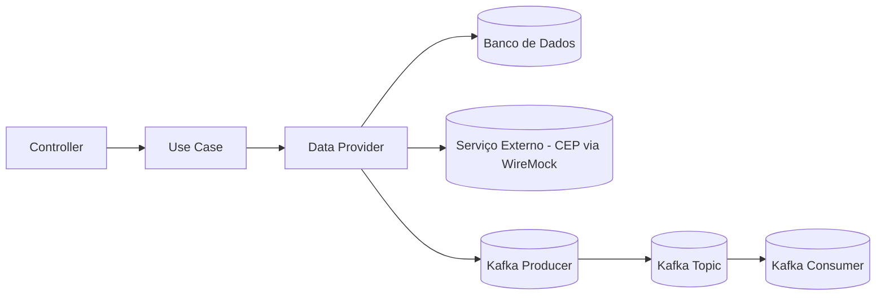

# 🧼 CleanArch

> **Clean Architecture + Spring Boot + Kafka + Docker + WireMock**  
> Um projeto de exemplo para demonstrar como estruturar aplicações Java de forma desacoplada, testável e escalável.  
> Inclui simulação de serviço externo de CEP usando **WireMock**.

---

## 📚 Sobre o Projeto
Este projeto implementa **Clean Architecture** para gerenciar clientes, integrando com serviços externos para:
- 📦 **Busca de endereço por CEP** (simulado com **WireMock**)
- 🆔 **Validação de CPF**
- 📡 **Comunicação assíncrona via Kafka**

O objetivo é servir como **guia prático** para desenvolvedores que desejam aplicar boas práticas de arquitetura em projetos reais.

---

## 🏗 Estrutura da Arquitetura

```
src/main/java/com/carvalho/cleanarch
│
├── config/                                # Configurações de beans e integrações
│   ├── DeleteCustomerByIdConfig
│   ├── FindCustomerByIdConfig
│   ├── InsertCustomerConfig
│   ├── KafkaConsumerConfig
│   ├── KafkaProducerConfig
│   └── UpdateCustomerConfig
│
├── core/
│   ├── domain/                            # Entidades de negócio
│   │   ├── Address
│   │   └── Customer
│   │
│   ├── usecase/                           # Interfaces dos casos de uso
│   │   ├── DeleteCustomerByIdUseCase
│   │   ├── FindCustomerByIdUseCase
│   │   ├── InsertCustomerUseCase
│   │   ├── UpdateCustomerUseCase
│   │   └── impl/                          # Implementações dos casos de uso
│   │       ├── DeleteCustomerByIdUseCaseImpl
│   │       ├── FindCustomerByIdUseCaseImpl
│   │       ├── InsertCustomerUseCaseImpl
│   │       └── UpdateCustomerUseCaseImpl
│   │
│   └── dataprovider/                      # Implementações internas ligadas ao domínio
│       ├── DeleteCustomerById
│       ├── FindAddressByZipCode
│       ├── FindCustomerById
│       ├── InsertCustomer
│       ├── SendCpfForValidation
│       └── UpdateCustomer
│
├── dataprovider/                          # Implementações de acesso a dados e serviços externos
│   ├── client/                            # Clientes HTTP para serviços externos
│   │   ├── FindAddressByZipCodeClient
│   │   ├── mapper/
│   │   │   └── AddressResponseMapper
│   │   └── response/
│   │       └── AddressResponse
│   │
│   └── repository/                        # Repositórios e persistência
│       ├── CustomerRepository
│       ├── entity/
│       │   ├── AddressEntity
│       │   └── CustomerEntity
│       ├── mapper/
│       │   └── CustomerEntityMapper
│       └── impl/
│           ├── DeleteCustomerByIdImpl
│           ├── FindAddressByZipCodeImpl
│           ├── FindCustomerByIdImpl
│           ├── InsertCustomerImpl
│           ├── SendCpfForValidationImpl
│           └── UpdateCustomerImpl
│
├── entrypoint/
│   ├── controller/                        # Endpoints REST
│   │   ├── CustomerController
│   │   ├── mapper/
│   │   │   └── CustomerMapper
│   │   ├── request/
│   │   │   └── CustomerRequest
│   │   └── response/
│   │       ├── AddressResponse
│   │       └── CustomerResponse
│   │
│   ├── consumer/                          # Consumidores Kafka
│   │   ├── ReceiveValidatedCpfConsumer
│   │   ├── mapper/
│   │   │   └── CustomerMessageMapper
│   │   └── message/
│   │       └── CustomerMessage
│   │
│   └── CustomerApplication                 # Classe principal
│
└── resources/
    ├── application.yml                     # Configurações da aplicação
    ├── static/                             # Recursos estáticos
    └── templates/                          # Templates (se aplicável)

docker-local/
└── docker-compose.yml                      # Sobe Kafka, DB e WireMock
```

---

## 🚀 Tecnologias Utilizadas

| Categoria          | Tecnologias |
|--------------------|-------------|
| **Linguagem**      | Java 17 |
| **Framework**      | Spring Boot |
| **Build Tool**     | Gradle |
| **Mensageria**     | Apache Kafka |
| **Container**      | Docker & Docker Compose |
| **Banco de Dados** | MongoDB |
| **Mapper**         | MapStruct |
| **Utilitários**    | Lombok |
| **Testes/Stub**    | WireMock |

---

## ⚙️ Como Executar

### 1️⃣ Clonar o repositório
```bash
git clone https://github.com/Braulio-Carvalho/cleanarch.git
cd cleanarch
```

### 2️⃣ Subir dependências com Docker
```bash
docker-compose -f docker-local/docker-compose.yml up -d
```
> O [`docker-compose.yml`](docker-local/docker-compose.yml) sobe Kafka, banco de dados e WireMock.

### 3️⃣ Rodar a aplicação
```bash
./gradlew bootRun
```
A aplicação estará disponível em:  
🌐 **http://localhost:8081**

---

## 🧪 Executando Testes
```bash
./gradlew test
```

---

## 📡 Endpoints Principais

| Método | Endpoint                  | Descrição |
|--------|---------------------------|-----------|
| **POST** | `/customers`             | Cadastrar cliente |
| **GET**  | `/customers/{id}`        | Buscar cliente por ID |
| **PUT**  | `/customers/{id}`        | Atualizar cliente |
| **DELETE** | `/customers/{id}`      | Remover cliente |
| **GET**  | `/address/{zipcode}`     | Buscar endereço por CEP |

---

## 🧷 Stubs do WireMock para CEP

Crie a pasta:
```
wiremock/mappings/
```

E adicione os arquivos:

### `address.json`
```json
{
  "request": {
    "method": "GET",
    "url": "/addresses/38400000"
  },
  "response": {
    "status": 200,
    "headers": {
      "Content-Type": "application/json"
    },
    "jsonBody": {
      "street": "Rua Clean Architecture",
      "city": "Uberlândia",
      "state": "Minas Gerais"
    }
  }
}
```

### `address2.json`
```json
{
  "request": {
    "method": "GET",
    "url": "/addresses/38400001"
  },
  "response": {
    "status": 200,
    "headers": {
      "Content-Type": "application/json"
    },
    "jsonBody": {
      "street": "Rua das Flores",
      "city": "São Paulo",
      "state": "São Paulo"
    }
  }
}
```

> 💡 **Teste rápido**:
> ```bash
> curl http://localhost:8082/addresses/38400000
> curl http://localhost:8082/addresses/38400001
> ```

---

## 🗺 Fluxo da Arquitetura



---

## 📄 Licença
Este projeto está sob a licença **MIT** - veja o arquivo [LICENSE](LICENSE) para mais detalhes.
